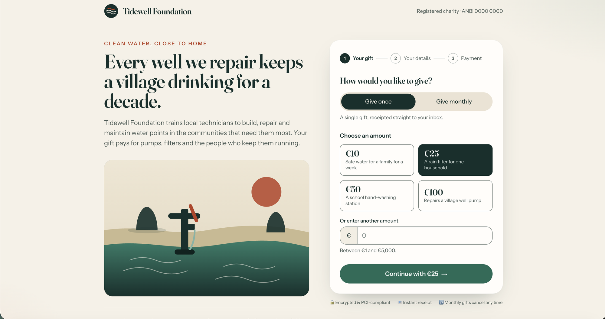

# Multi-Framework donation page on Salesforce + FinDock

A public, guest-accessible donation page built as a **React UI bundle (Salesforce Multi-Framework)** hosted on an
**Experience Cloud** site, taking one-time and monthly gifts through the **FinDock Payment API** called
**on-platform** (no REST callout, no token, no CORS).

Live example (lab org): `https://<my-domain>.my.site.com/donate/`



```
┌──────────────────────────────┐   platform SDK fetch (guest session)   ┌───────────────────────────────┐
│ React UI bundle  DonatePortal│ ─────────────────────────────────────▶ │ DonationPaymentResource       │
│  /            Donate.tsx     │  GET  /apexrest/donate/v1/config       │  @RestResource (Apex)         │
│  /thank-you   ThankYou.tsx   │  POST /apexrest/donate/v1/intent       │  → DonationPaymentService     │
│  /failed      Failed.tsx     │ ◀───────────────────────────────────── │    validates policy, builds   │
└──────────────┬───────────────┘   {status, redirectUrl, errors[]}      │    PaymentIntent              │
               │ window.location = redirectUrl                          └──────────────┬────────────────┘
               ▼                                                                       │ in-transaction
     PSP hosted checkout (Stripe via FinDock)                                          ▼ RestContext swap
     → returns to /thank-you or /failed                                 cpm.API_PaymentIntent_V2.postPaymentIntent()
                                                                        cpm.API_PaymentMethod_V2.getPaymentMethods()
```

## What is in here

| Path | Purpose |
|---|---|
| `force-app/main/default/uiBundles/DonatePortal/` | React + Vite + TypeScript + Tailwind app (3-step form, PSP return pages) |
| `…/classes/DonationPaymentResource.cls` | Guest-facing Apex REST wrapper (`/donate/v1/config`, `/donate/v1/intent`) |
| `…/classes/DonationPaymentService.cls` | Donation policy, PaymentIntent assembly, FinDock response normalisation |
| `…/classes/FinDockRestContextGateway.cls` | Calls the FinDock managed classes in-transaction (swaps `RestContext`) |
| `…/classes/DonationSettings.cls` | Typed reader for the `Donation_Page_Setting__mdt` custom metadata |
| `…/objects/Donation_Page_Setting__mdt/` + `…/customMetadata/Donation_Page_Setting.Default.md-meta.xml` | All org-specific configuration (see below) |
| `…/permissionsets/Donation_Public_Access.permissionset-meta.xml` | Apex execute access for the site guest user (no object CRUD) |
| `…/cspTrustedSites/` | Allow FinDock CDN logos (`external.findock.com`, `images.findock.com`) |
| `…/networks`, `…/sites`, `…/digitalExperienceConfigs`, `…/digitalExperiences` | The `Donate` Experience site that hosts the bundle at `/donate` |

## Design decisions

- **Server-side policy, client-side UX.** The browser is never trusted: amount bounds, frequency, offered methods,
  method parameters (only those FinDock declares; enum values must match), payer shape and return-URL origin are
  all validated in Apex. Return URLs are supplied by the page (so the site prefix survives the PSP round-trip) but
  must point back to this site, so the endpoint cannot be used as an open redirect.
- **Nothing hardcoded per org.** Everything that differs between orgs lives in one custom metadata record:
  currency, processor, payer record type (Person Account for Fundraising, Contact otherwise), offered methods per
  frequency, presets with impact hints, amount bounds, default campaign, origin, support email.
- **Payment methods come from FinDock at runtime.** The wrapper calls `getPaymentMethods()`, keeps only the
  configured methods (in configured order), resolves the processor (configured override → FinDock default → first)
  and passes method logos, `SupportsRecurring`, `InitialPaymentOnRecurring` and parameter definitions (including
  enum options with label + image) to the page. Adding iDEAL issuers or a new method is a config change, not code.
- **Recurring gifts** send `Recurring {Amount, Frequency: Monthly, StartDate, CurrencyISOCode}`. If the processor
  *requires* an initial payment, a `OneTime` block for the same amount is added and the schedule starts one month
  later so the donor is not charged twice.
- **Error handling follows FinDock guidance.** Codes 201–205 are the only payer-recoverable errors and are mapped
  to fields; everything else becomes one generic message (raw FinDock text never reaches the donor, it is logged).
- **Accessibility and mobile are built in:** WCAG 2.2 AA contrast, visually-hidden-but-focusable radios, labels and
  `aria-describedby` on every error, `role=status` step announcements, reduced-motion support, 44px targets,
  16px inputs, single column at 390px.

## Prerequisites (public site)

1. FinDock (`cpm`) installed with at least one processor and method active (this org: Stripe).
2. **FinDock ProcessingHub installed and connected** (FinDock Setup), its integration user holding the
   *FinDock Integration User* permission set group. When a guest creates a PaymentIntent, FinDock queues a
   `cpm.GuidedMatchingJob.UserSwitcher` message and hands processing to that user through the hub. Without a
   connected hub the donor still reaches the PSP, but the message stays `Scheduled` and no Installment or
   Gift Transaction is ever created. (In this lab org the hand-off is not completing: today's test intents
   are all `Scheduled`, so verify the connection in FinDock Setup → Connect → ProcessingHub.)
3. Multi-Framework (React) enabled and Digital Experiences enabled in the org.

### Guest user permissions

Per the FinDock docs the site guest user needs the **FinDock Payer** permission set group (`cpm__FinDock_Payer`),
which FinDock maintains itself (it contains *FinDock Core Experience Cloud Run* and *FinDock Experience Cloud*
and receives package-specific sets as processors are activated), plus this repo's `Donation_Public_Access` set
for the Apex REST wrapper. Do not assign individual FinDock permission sets directly.

## Deploy

```bash
# 1. Backend (custom metadata, Apex, permission set, CSP) — with tests
sf project deploy start -o <alias> \
  -d force-app/main/default/objects -d force-app/main/default/customMetadata \
  -d force-app/main/default/classes -d force-app/main/default/permissionsets \
  -d force-app/main/default/cspTrustedSites \
  -l RunSpecifiedTests -t DonationPaymentServiceTest -t DonationPaymentResourceTest -t FinDockRestContextGatewayTest

# 2. Frontend build + UI bundle
(cd force-app/main/default/uiBundles/DonatePortal && npm install && npm run build)
sf project deploy start -o <alias> -d force-app/main/default/uiBundles

# 3. Experience site
sf project deploy start -o <alias> -d force-app/main/default/networks -d force-app/main/default/sites \
  -d force-app/main/default/digitalExperienceConfigs -d force-app/main/default/digitalExperiences

# 4. Guest user permissions (guest user: Site.GuestUserId of the "Donate" site)
sf org assign permset -o <alias> -n Donation_Public_Access -b <guest username>
# FinDock Payer permission set group (the CLI has no permsetgroup command; create the assignment record):
sf data create record -o <alias> -s PermissionSetAssignment -v "AssigneeId=<guest user Id> PermissionSetGroupId=<Id of PermissionSetGroup FinDock_Payer>"
```

The page is then served at `https://<my-domain>.my.site.com/donate/`.

## Porting to another org — edit the `Default` custom metadata record

| Field | This org | Check |
|---|---|---|
| Currency ISO Code | `EUR` | Must be active in the org; SEPA DD rejects non-EUR |
| Payment Processor | `PaymentHub-Stripe` | Blank = FinDock default per method (this org has no defaults set) |
| Payer Record Type | `PersonAccount` | Fundraising/NPC needs a Person Account record type; blank = Contact payer |
| One-Time / Recurring Methods | `Ideal,CreditCard,SEPA Direct Debit` / `SEPA Direct Debit,CreditCard` | Only methods active in FinDock are shown; recurring also needs `SupportsRecurring` |
| Source Connector | blank | e.g. `FinDock-for-Fundraising`; blank = org default |
| Min / Max Amount, presets, campaign, origin, support email | see record | Presets accept `amount|impact hint` pairs |

## Local development

```bash
cd force-app/main/default/uiBundles/DonatePortal
npm run dev            # http://localhost:5173 — mock config by default (src/api/donation/mockDonationApi.ts)
VITE_DONATION_API=org npm run dev   # proxy API calls to the default org through the UI-bundle dev proxy
npm test               # Vitest unit tests (validation, money formatting, response normalisation)
npm run e2e:screenshots                                   # desktop + mobile screenshots into e2e-output/
BASE_URL=https://<my-domain>.my.site.com/donate/ npm run e2e:smoke   # guest flow against the live site
```

## Things to replace before going live

- Organisation copy, hero illustration (`src/assets/hero.svg` is a placeholder), charity registration number,
  address and policy links in `appLayout.tsx`, `Hero.tsx`, `ThankYou.tsx`.
- The test Stripe keys behind FinDock (managed in FinDock Setup, never in this repo).
- Review guest-user record access on the site (Setup → Digital Experiences → the site → Administration).

## Notes

- Multi-Framework is a beta feature; deploy to sandboxes, scratch or developer orgs.
- The FinDock managed entry points take no arguments and read/write `RestContext`
  (`cpm.API_PaymentIntent_V2.postPaymentIntent()`); this was verified against the org, and is the pattern in the
  FinDockLabs `findock-experience-cloud-examples` repository.
